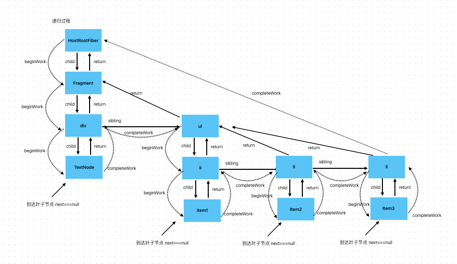

# workLoop 渲染流程
React的渲染流程从 scheduleUpdateOnFiber开始，其定义在 [lib/react-reconciler/workLoop.ts](../lib/react-reconciler/workLoop.ts)

## scheduleUpdateOnFiber
从跟节点开始调度，实现如下
```typescript
/** 在Fiber中调度更新 */
export function scheduleUpdateOnFiber(fiberNode: FiberNode, lane: Lane) {
  /** 先从更新的fiber节点递归到hostRootFiber
   *  这个过程中，一个目的是寻找fiberRootNode节点
   *  一个是更新沿途的 childLines
   */
  const fiberRootNode = markUpdateLaneFromFiberToRoot(fiberNode, lane);
  // 更新root的pendingLane, 更新root节点的pendingLanes 表示当前正在处理的lanes
  markRootUpdated(fiberRootNode, lane);
  // 保证根节点被正确调度
  ensureRootIsScheduled(fiberRootNode);
}
```
1. 先调用markUpdateFromFiberToRoot 其本质实现是从当前待更新的节点向上更新，到HostRoot节点为止，把当前更新对应的lane传递上去，并且找到返回FIberRootNode节点.
```typescript
/**
 * 从当前fiberNode找到root节点 并且更新沿途fiber的childLanes
 * @param fiberNode
 */
export function markUpdateLaneFromFiberToRoot(
  fiberNode: FiberNode,
  lane: Lane
) {
  let parent = fiberNode.return; // parent表示父节点
  let node = fiberNode; // node标记当前节点
  while (parent !== null) {
    parent.childLanes = mergeLane(parent.childLanes, lane);
    const alternate = parent.alternate;
    if (alternate !== null) {
      alternate.childLanes = mergeLane(alternate.childLanes, lane);
    }
    // 处理parent节点的childLanes
    node = parent;
    parent = parent.return;
  }

  /** 检查当前是否找到了hostRootFiber */
  if (node.tag === HostRoot) {
    return node.stateNode;
  }

  return null;
}
```
2. 使用markRootUpdate把当前更新的lane merge到root.pendingLanes上
3. 调用 ensureRootIsScheduled 进行优先级调度

## ensureRootIsScheduled
这个函数的功能也很简单，就是获取当前root.pendingsLanes中优先级最高的lane，
判断当前的优先级lane 是不是同步优先级，如果是同步优先级，就加入到microTask微任务队列中，在当前同步任务执行之后，按顺序调用微任务，
如果当前lane不是同步，低于同步，就需要交给scheduler管理，调用scheduler.scheuleCallback来注册任务，并且对应的优先级需要通过lanesToSchedulerPriority(lane)函数获得。 实现如下:
```typescript
export function ensureRootIsScheduled(root: FiberRootNode) {
  // 先实现同步调度 获取当前最高优先级
  const highestPriorityLane = getNextLane(root);
  // 判断，如果不存在优先级 说明没有任务需要继续调度了 直接returna
  if (highestPriorityLane === NoLane) return;
  // 批处理更新, 微任务调用更新
  if (highestPriorityLane === SyncLane) {
    scheduleSyncCallback(performSyncWorkOnRoot.bind(null, root));
    // 设置微任务回调 冲洗缓冲区
    flushSyncCallbacks();
  } else {
    // 其他优先级 使用scheduler调度
    scheduler.scheduleCallback(
      lanesToSchedulerPriority(highestPriorityLane),
      performConcurrentWorkOnRoot.bind(null, root)
    );
  }
}
```
调度的任务本身是 performWorkOnRoot / PerformConcurrentWorkOnRoot 对应的就是同步/异步状态下的处理

## performWOrkOnRoot / PerformConcurrentWorkOnRoot
其中 PerformConcurrentWorkOnRoot 就是实现了一个scheduler中的任务拆分，把大任务拆分成了小任务，即返回一个函数的形式 实现如下
```typescript
/** 从root开始 处理同步任务 */
export function performSyncWorkOnRoot(root: FiberRootNode) {
  // 获取当前的优先级
  const lane = getNextLane(root);

  if (lane !== SyncLane) {
    /**
     * 这里 lane如果不是同步任务了，说明同步任务的lane已经被remove 应该执行低优先级的任务了
     *  此时应该停止执行当前任务 重新调度
     * 【实现同步任务的批处理，当第一次执行完之后 commit阶段remove SyncLane 这里就继续不下去了，
     * 后面微任务中的 performSyncWorkOnRoot都不执行了】
     */
    return ensureRootIsScheduled(root);
  }

  // 开始生成fiber 关闭并发模式
  const exitStatus = renderRoot(root, lane, false);
  switch (exitStatus) {
    // 注意 同步任务一次性执行完 不存在RootInComplete中断的情况
    case RootCompleted:
      // 执行成功 设置finishedWork 和 finishedLane 并且commit
      // 设置root.finishedWork
      root.finishedWork = root.current.alternate;
      root.finishedLane = lane;
      // 设置wipRootRenderLane = NoLane;
      wipRootRenderLane = NoLane;
      commitRoot(root);
    default:
    // TODO Suspense的情况
  }
}

/** 从root开始 处理并发任务
 *  这个函数是要传入schduler中的 其中didTimeout就是当前任务是否超时
 */
export function performConcurrentWorkOnRoot(
  root: FiberRootNode,
  didTimeout: boolean
) {
  const lane = getNextLane(root);
  if (lane === NoLane) {
    // 没有任务需要处理了 这里也不需要调度了 用来完成批处理
    return;
  }

  // 开始生成fiber 关闭并发模式 ,在没有超时的情况下，可以开启并发中断
  const exitStatus = renderRoot(root, lane, !didTimeout);
  switch (exitStatus) {
    case RootInComplete:
      // 中断的情况 需要返回subTask 重新注册任务
      return performConcurrentWorkOnRoot.bind(null, root);
    case RootCompleted:
      //任务完成 收尾 commit
      // 设置root.finishedWork
      root.finishedWork = root.current.alternate;
      root.finishedLane = lane;
      // 设置wipRootRenderLane = NoLane;
      wipRootRenderLane = NoLane;
      commitRoot(root);
  }
}
```
注意 这两个函数都是先获取一下当前优先级最高的lane 因为react是并发更新的，可能当前的函数执行时，注册这个函数的优先级lane已经被处理完了，所以就需要判断一下，当前的lane还是否需要处理，如果当前lane 不存在了 就看看还有没有其他lane需要从处理，如果没有就return 如果有就转去处理这个优先级

对于performWorkOnRoot 其只处理同步任务，如果任务是异步的，就return不处理

对于performConcurrentWorkOnRoot 在renderRoot结束之后，还会判断还有没有剩余的fiber没处理，即workInProgress是不是为null,如果还有，则继续返回子任务,并且次函数还接受didTimeout 表示当前任务是否超时，如果超时这个任务就无法被打断了。

通过这个函数可以看出 render更新分为  render 和 commit 两个阶段，其中render阶段由 renderRoot函数完成

## renderRoot 
这个函数用来完成render阶段，其接受root 当前渲染的lane 以及是否打开时间片模式
注意 在同步模式下 默认时间片关闭 在异步模式下，只有在不超时的情况下才打开时间片，也就是说，如果超时，则会优先完成当前lane的更新，会同步执行

实现如下:
```typescript
/**
 * 渲染root 生成fiber对象
 * @param root  当前根节点
 * @param lane  当前车道
 * @param shouldTimeSlice 是否开启并发
 */
export function renderRoot(
  root: FiberRootNode,
  lane: Lane,
  shouldTimeSlice: boolean
) {
  let workLoopRetryTimes = 0;

  if (wipRootRenderLane !== lane) {
    console.log('中断')
    // 避免重新进行初始化
    /** 先进行准备初始化 */
    prepareRefreshStack(root, lane);
  }

  while (true) {
    try {
      // 开启时间片 scheduler调度
      shouldTimeSlice ? workConcurrentLoop() : workLoop();
      break;
    } catch (e) {
      /** 使用try catch保证workLoop顺利执行 多次尝试 */
      workLoopRetryTimes++;
      if (workLoopRetryTimes > 20) {
        console.warn("workLoop执行错误！", e);
        break;
      }
    }
  }

  /** 判断任务是否执行完成 如果执行完成RootCompleted 否则 返回RootInCompleted*/
  if (shouldTimeSlice && workInProgress !== null) {
    return RootInComplete;
  }

  // 任务完成
  return RootCompleted;
}
```
注意，开启render之前，会先调用prepareRefreshStack函数，开启一个新的工作栈
react全局会维护一个 
- renderLane变量，表示当前正在执行的更新对应的优先级
- workInProgress变量，表示当前正在处理的Fiber节点
renderRoot中会判断，传入的lane是否为当前的renderLane ，如果是则表示当前lane正在更新，继续执行，如果不是，则表示当前更新的lane已经被更高优先级的更新打断了，此时调用prepareRefreshStack开启新的工作栈，把renderLane改成最新的lane 并且把workInProgress置null，开启新的更新流程。

其中 prepareRefreshStack实现如下:
```typescript
/**
 * prepareFreshStack 这个函数的命名可能会让人觉得它与“刷新（refresh）”相关，
 * 但它的作用实际上是为了 准备一个新的工作栈，而不是刷新。
 * @param root
 * @param lane 当前车道
 */
function prepareRefreshStack(root: FiberRootNode, lane: Lane) {
  // 重新赋finishedWork
  root.finishedWork = null;
  root.finishedLane = NoLane;
  // 设置当前的运行任务lane
  wipRootRenderLane = lane;
  /** 给workInProgress赋值 */
  /** 这里在首次进入的时候 会创建一个新的hostRootFiber
   * 在react中存在两棵fiber树，两个hostRootFiber根节点 用alternate链接，成为双缓存
   */

  workInProgress = createWorkInProgress(root.current, {});
}
```
其中 createWorkInProgress 会建立一个新的Fiber节点，即切换到另外一个HostRootFiber,如图所示:


准备完工作栈，就是根据是否开启时间片参数，选择是否调用并发的 workLoop

## workLoop函数
workLoop函数就是判读workInProgress是不是为空，如果不是则继续渲染
```typescript
/** 递归循环 */
function workLoop() {
  while (workInProgress) {
    performUnitOfWork(workInProgress);
  }
}

/** 在并发模式下，如果shouldYieldToHost 则让出主线程 暂停render过程 */
function workConcurrentLoop() {
  while (workInProgress && !scheduler.shouldYieldToHost()) {
    performUnitOfWork(workInProgress);
  }
}

```
其中 并发模式下，会在每次while判断的时候 看看是不是应该让出主线程了，即当前子任务时间片是不是超时了。

### render过程 深度优先 performUnitOfWork
performUnitOfWork用来深度优先处理单个节点,render阶段分成两个阶段，一个为递到阶段也就是beginwork阶段，此阶段通过element创建/复用fiber react的协调阶段和DIFF算法也是再次阶段

beginWork阶段会一致递到叶子节点，然后开启completework阶段 也就是归的阶段

次阶段会完成新增节点的建立，父子节点关系的建立，Ref标记的判断，以及lanes和flags的冒泡

这两个阶段有performUnitOfWork协调，实现如下
```typescript
/**
 * 处理单个fiber单元 包含 递，归 2个过程
 * @param fiber
 */
function performUnitOfWork(fiber: FiberNode) {
  // beginWork 递的过程
  const next = beginWork(fiber, wipRootRenderLane);
  // 递的过程结束，保存pendingProps
  fiber.memorizedProps = fiber.pendingProps;
  // 这里不能直接给workInProgress赋值，如果提前赋workInProgress为null 会导致递归提前结束
  // 如果next为 null 则表示已经递到叶子节点，需要开启归到过程
  if (next === null) {
    /** 开始归的过程 */
    completeUnitOfWork(fiber);
  } else {
    // 继续递
    workInProgress = next;
  }
  // 递的过程可打断，每执行完一个beginWork 切分成一个任务
  // complete归的过程不可打断，需要执行到下一个有sibling的节点/根节点 (return === null)
}
```
其递归过程如图:


## commitUnitOfWork
render阶段结束后，会调用commitRoot 同样是深度优先的调用commitUnitOfWork遍历新生成的Fiber树，对节点进行新增，挂载，删除，副作用收集 等等工作
