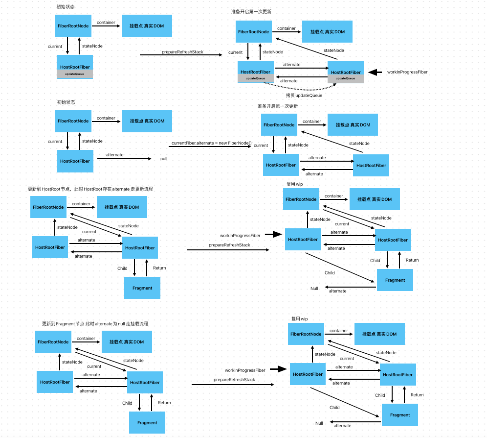

# 协调流程
协调流程可以在 [/lib/react-reconciler/childReconciler.ts](../lib/react-reconciler/childReconciler.ts) 中找到

在beginWork中，调用了reconcileChild函数，这个函数的实现如下:
```typescript
/**
 * 协调当前节点和其子节点
 * @param wip
 * @param children
 */
function reconcileChildren(wip: FiberNode, children: ReactElementChildren) {
  /** 这里需要注明一下：
   * 当wip.alternate === null 的时候 也就是挂载阶段，此时children不需要添加副作用 即flags subtreeFlags delection 这些，因为当前dom中
   * 并不存在先前的节点，在completeWork阶段 会创建这些节点 并且完成福子节点之间的链接
   * 并不需要对其进行挂载等操作，由于hostRootFiber 一定有alternate节点，在prepareRefreshStack中构建，所以只在hostRootFiber中挂载即可
   */

  if (wip.alternate !== null) {
    // update阶段
    wip.child = reconcileChildFiber(wip, wip.child, children);
  } else {
    // mount阶段
    wip.child = mountChildFiber(wip, children);
  }
}
```
这个函数先判断当前正在处理的Fiber节点是不是第一次挂载，判断的方式就是当前节点的alternate是不是为null

我们知道 react使用双缓冲树的方式，在首次挂载的时候,除了HostRoot有alternate节点以外，其他新创建的Fiber节点都是没有alternate的

此时，我们只需要在处理HostRoot的时候进行更新操作，其余节点都采用挂载操作，其区别在于，更新操作会在Fiber.flag上标记插入标志，挂载不会进行任何标记

在complete阶段，会创建所有挂载的节点，并且完成父子元素的链接，在complete阶段完成的时候，会存在一棵没有被挂载到真实dom树上的离屏dom树，此时只需要在commit阶段完成一次对HostRoot的挂载即可！



## reconcileChildFiber & mountChildFiber
这两个函数都是由childReconciler提供,其都是由childReconciler(shouldTrackEffect)这个高阶函数返回，区别在于入参shouldTrackEffect，表示是否需要标记副作用

```typescript
/** 协调子元素 */
export function reconcileChildFiber(
  wip: FiberNode,
  currentChild: FiberNode,
  children: ReactElementChildren
) {
  return childReconciler(true)(wip, currentChild, children);
}

/** 挂载子元素 */
export function mountChildFiber(
  wip: FiberNode,
  children: ReactElementChildren
) {
  return childReconciler(false)(wip, null, children);
}
```

## childReconciler 协调器
childReconciler函数是个高阶函数，其内部用闭包的方式封装了对Fiber元素的操作 创建 复用的操作，我们先来看其返回的函数

其暴露出去的函数做的事情就是，根据传入的newChild的判断该调用哪个处理函数！

先判断child，如果child是个数组或者对象，那么继续判断
1. 判断Fragement 是REACT_FRAGMENT_TYPE 说明当前Fiber是一个Fragment类型的Fiber 此时应该把pendingProps.children 赋给 pendingProps 因为Fragment类型的Props就是children

2. 判断，如果newChildren是个数组，那么调用array的处理逻辑 reconcileArray
3. 判断，如果newChildren是个单一元素，那么调用reconcileSingle 这也是为什么在createElement中，会把单一子元素的情况从数组转换成一个元素,因为这种情况下不需要用数组的逻辑来处理

如果child是string, 那么调用reconcileTextNode处理
```typescript
  return (
    wip: FiberNode,
    currentChild: FiberNode,
    newChild: any
  ): FiberNode => {
    // 处理Fragment
    if (typeof (newChild as ReactElement) === "object" && newChild !== null) {
      if ((newChild as ReactElement).type === REACT_FRAGMENT_TYPE) {
        // 更新newChild 为Fragment内容
        newChild = newChild?.props?.children;
      }

      // 如果是多节点 Diff
      if (Array.isArray(newChild)) {
        return reconcileArray(wip, currentChild, newChild);
      }
      // 如果是单节点 看是否key type一样 是否可复用
      return reconcileSingle(wip, currentChild, newChild);
    }

    // 如果是文本节点 (文字或者数字 -> 转换成文本节点)
    if (typeof newChild === "string" || typeof newChild === "number") {
      return reconcileTextNode(wip, currentChild, newChild);
    }

    return null;
  };
```

## reconcileChild & reconcileTextNode
先来看简单的情况，如果newChild为单一元素 或者一段文本的情况 
如果是单一普通元素，我们需要检查是否有节点能够复用，如果判断复用，就是查看旧的节点的类型和key 是否和新节点相等。

由于旧节点可能有多个，即上一次更新生成了多个child在当前fiber下，此时需要遍历所有的旧节点，以此比对type和key是否相同， 若相同，则进入复用流程，如果不相同，直接删除节点。

如果找到了可以复用的节点，说明剩下的节点都没用了，此时需要删除剩下所有的节点

如果遍历完还没有找到可以复用的节点，那么就需要新建一个Fiber节点

逻辑如下:
```typescript
  /** 处理单个子节点的情况 */
  function reconcileSingle(
    wip: FiberNode,
    currentChild: FiberNode,
    newChild: ReactElement
  ): FiberNode {
    /** 先判断  如果element类型不对，直接报错 */
    if (newChild.$$typeof !== REACT_ELEMENT_TYPE) {
      throw new Error("[object] is not a valid react element!");
    }

    while (currentChild !== null) {
      // 先判断key
      if (newChild.key === currentChild.key) {
        // 再判断类型
        if (newChild.type === currentChild.type) {
          // 类型和key都一样，可以复用
          let pendingProps = newChild.props;
          // 判断 是不是Fragment类型
          if (newChild.type === REACT_FRAGMENT_TYPE) {
            // 设置props,element元素的props就是children 不支持其他的props
            pendingProps = newChild.props.children;
          }
          const existingFiber = useFiber(currentChild, pendingProps);
          existingFiber.return = wip;
          // 找到节点，删除剩下的节点
          deleteRemainingChildren(wip, currentChild.sibling);
          return existingFiber;
        }
      }
      // 删除当前节点
      deleteChild(wip, currentChild);
      // 设置下一个 childFiber
      currentChild = currentChild.sibling;
    }

    // 都没摘到key和type都相同的 创建
    const newFiber = createFiberFromElement(newChild);
    newFiber.return = wip;
    if (shouldTrackEffect) {
      /** 设置副作用 */
      newFiber.flags |= Placement;
    }
    return newFiber;
  }
```

删除节点的逻辑也很简单，就是根据shouldTrackEffect判断，是否需要打标记，如果需要打标记就在当前正在处理的fiber节点上打上Deletion标记，并且在deletion数组中推入当前待删除的节点，在commit阶段会消费这个Deletion标记，并且完成真实DOM的删除工作！

批量删除后面的节点是顺着sibling 调用删除节点方法 实现如下:

```typescript
  /**
   *  删除子节点
   * @param returnFiber 父节点
   * @param childToDelete 待删除的子节点
   * @returns
   */
  function deleteChild(returnFiber: FiberNode, childToDelete: FiberNode) {
    // 不需要标记副作用
    if (!shouldTrackEffect) return;
    if (!returnFiber.delections) {
      // 当前returnFiber下 没有等待删除的节点
      returnFiber.delections = [childToDelete];
      returnFiber.flags |= ChildDeletion;
    } else {
      // 当前returnFiber下 已经有等待删除的节点 就不用重复设置flags了
      returnFiber.delections.push(childToDelete);
    }
  }
  /**
   * 批量删除剩余的子节点
   * @param returnFiber 父节点
   * @param remainingFirstChild 剩余待删除的子节点中的第一个
   */
  function deleteRemainingChildren(
    returnFiber: FiberNode,
    remainingFirstChild: FiberNode
  ) {
    // 不需要标记副作用
    if (!shouldTrackEffect) return;
    while (remainingFirstChild !== null) {
      deleteChild(returnFiber, remainingFirstChild);
      remainingFirstChild = remainingFirstChild.sibling;
    }
  }
```

复用节点通过useFiber函数实现，其实现如下:
```typescript
/** 复用节点，如果存在alternate则复用 不存在则创建 调用createWorkInProgress */
function useFiber(currentFiber: FiberNode, pendingProps: ReactElementProps) {
  const wip = createWorkInProgress(currentFiber, pendingProps);
  wip.sibling = null;
  wip.index = 0;
  return wip;
}
```

通过调用createWorkInProgress函数实现旧节点复用

这个函数在prepareRefreshStack中调用过，目的就是
1. 如果当前节点存在alternate，那么复用
2. 如果不存在 那么创建
```typescript
/** 根据现有的Fiber节点，创建更新的Fiber节点
 * 如果当前Fiber节点存在alternate 复用
 * 弱不存在，创建新的FiberNode
 * 将current的内容拷贝过来 包含lane memorizedState/props child 等
 *
 * 在Fiber节点内容可以复用的情况调用，新的fiber节点的 tag type stateNode 等会复用 ｜ props，lane flags delecation这些副作用 会重置
 */
export function createWorkInProgress(
  currentFiber: FiberNode,
  pendingProps: ReactElementProps
) {
  /** 创建wip 当前的workInProgress 先看看能不能复用.alternate */
  let wip = currentFiber.alternate;

  if (wip === null) {
    /** mount阶段，说明对面不存在alternate节点 */
    wip = new FiberNode(currentFiber.tag, pendingProps, currentFiber.key);
    /** stateNode为fiber对应的真实dom节点 */
    wip.stateNode = currentFiber.stateNode;
    /** 建立双向的alternate链接 */
    wip.alternate = currentFiber;
    currentFiber.alternate = wip;
  } else {
    /** update节点，复用 重置副作用 */
    wip.flags = NoFlags;
    wip.subTreeFlags = NoFlags;
    wip.pendingProps = pendingProps;
    wip.delections = null;
  }

  // 剩下的可以复用
  wip.key = currentFiber.key;
  wip.tag = currentFiber.tag;
  wip.type = currentFiber.type;
  // ref需要传递
  wip.ref = currentFiber.ref;
  wip.memorizedState = currentFiber.memorizedState;
  wip.memorizedProps = currentFiber.memorizedProps;
  wip.updateQueue = currentFiber.updateQueue;
  //  这里需要注意，只需要复用child 可以理解为 新的节点的child指向currentFiber.child 因为后面diff的时候 只需要用的child，仅做对比，
  // 后面会创建新的fiber 此处不需要sibling和return 进行了连接 可以理解成 只复用alternate的内容 不复用其节点之间的关系
  // stateNode也不需要复用 因为alternate和currentFiber之间 如果有关联，那么type一定是相等的
  wip.child = currentFiber.child;

  /** 注意复用的时候 一定要把lane拷贝过去 */
  wip.lanes = currentFiber.lanes;
  wip.childLanes = currentFiber.childLanes;
  return wip;
}
```
注意，复用的时候 child也会被复用过去，因为在beginWork/reconcilChild中，直接用的 wip.child
```typescipt
wip.child = reconcileChildFiber(wip, wip.child, children);
```

如果没有办法复用，那么就会调用 createFiberFromElement 即 通过element元素创建Fiber节点

这个函数传入element元素，返回通过这个元素创建的Fiber节点

我们知道，对于一个Element节点，其type可能是多种类型，比如
对于一个普通Host节点，其type一定是个字符串
对于一个Fragment节点，其type为 REACT_FRAGMENT_TYPE这个Symbol类型
其他情况下 type一定是个复杂类型 即 typeof type === 'object'
那么此时，需要再继续判断：
1. 如果是函数类型 即 typeof type === 'function' 那么为函数组件
2. 如果是普通对象，那么需要继续判断普通对象内的 $$typeof属性
```text
对于 Memo Context Suspense这些react内部提供的组件，其type是个对象，保存了一些基本信息，其中一个用来区分的属性就是 $$typeof 这个需要和ReactElement上的 $$typeof 区分！
```

所以，createFiberFromElement 其实本质上就是为了确定Fiber的tag字段，这个字段是唯一用来区分Fiber类型的字段，实现如下:
```typescript
/**
 * 从ReactElement对象 创建Fiber对象
 * @param element
 */
export function createFiberFromElement(element: ReactElement): FiberNode {
  // 默认fiberTag = FunctionComponent
  let fiberTag: WorkTag = FunctionComponent;
  let pendingProps: ReactElementProps = element.props;

  // hostComponent的element.type为string
  if (typeof element.type === "string") {
    fiberTag = HostComponent;
  } else if (typeof element.type === "object") {
    switch ((element.type as any)?.$$typeof) {
      case REACT_MEMO_TYPE:
        // 设置memo类型的fiberTag
        fiberTag = MemoComponent;
    }
  } else if (element.type === REACT_FRAGMENT_TYPE) {
    fiberTag = Fragment;
    return createFiberFromFragment(element.props.children, element.key);
  }

  const fiber = new FiberNode(fiberTag, pendingProps, element.key);
  fiber.type = element.type;
  // 这里需要设置ref 新创建的fiber节点 非复用的情况下 需要从element.ref获取ref
  fiber.ref = element.ref;
  return fiber;
}

export function createFiberFromFragment(
  elemenst: ReactElementChildren[],
  key: Key
) {
  const fragmentFiber = new FiberNode(Fragment, elemenst, key);
  return fragmentFiber;
}

```


