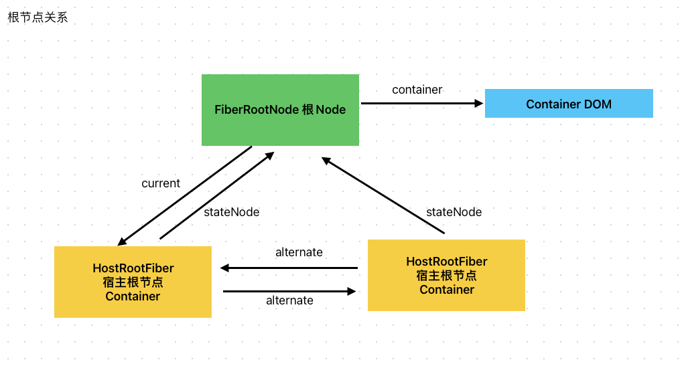

# 管理节点和根节点的关系
FiberRootNode 和 HostRootFiber关系图如下，需要注意几个点。

FiberRootNode不是Fiber节点，只是Fiber树的管理节点，而HostRootFiber才是真正的Fiber节点
（记忆 xxxFiber才是真正的Fiber节点）

Fiber中的关联指针 sibling child return 都只能指向Fiber节点，不能直接指向 FiberRootNode节点

所以，FiberRootNode.current = HostRootFiber, HostRootFiber.stateNode = FiberRootNode

这里不能用 FiberRootNode.child = HostRootFiber
HostRootFiber.return = FiberRootNode 这是个误区，印务 FiberRootNode根本不是Fiber节点，而是Fiber树的管理节点，所以其内部没有 return child这些节点。

current指向当前完成渲染的Fiber树，FiberRootNode的stateNode指向管理节点

管理节点 FiberRootNode上面保存了很多信息，其中就包含了 Container，也就是我们 createRoot(Container)传入的Container

具体如下:

